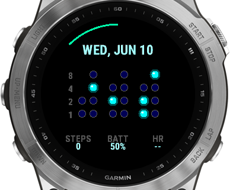

# Cyberpunk BCD Binary Watch Face

A premium, highly customizable, and visually stunning BCD and Pure Binary watch face for Garmin smartwatches. Designed for high contrast and visual depth, it features realistic glowing neon orbs with 3D glass reflections, making it perfect for both MIP (memory-in-pixel) and AMOLED screens.



## Features

- **Double Grid Layout Modes**:
  - **BCD (Binary Coded Decimal)**: Default layout. Columns represent individual decimal digits of Hours, Minutes, and Seconds.
  - **Pure Binary**: A purist layout with 3 columns representing the absolute values of Hours (5 bits), Minutes (6 bits), and Seconds (6 bits).
- **Vibrant Color Themes**: Select between 5 glowing neon themes directly from your phone: **Cyberpunk Cyan**, **Neon Pink**, **Radioactive Green**, **Sci-Fi Amber**, and **Monochrome Slate**.
- **Always-On Display (AOD) Protection**: Dynamic screen-dimming and pixel-shifting every minute to prevent screen burn-in on premium AMOLED Garmin models.
- **Smart Status Badges**:
  - **Phone Connected**: A glowing cyan status dot appears to the left of the Date when connected to Bluetooth.
  - **Notifications**: An amber badge appears to the right of the Date showing your unread notification count.
- **Customizable Dashboard Slots**: Configure the three bottom stats fields dynamically from your phone:
  - **STEPS**: Current step count.
  - **BATT**: Estimated remaining battery life (displays in **days**, e.g., `12.5d`, where supported; falls back to `%` on older devices).
  - **HR**: Current Heart Rate.
  - **TEMP**: Live weather temperature (auto-converts Celsius/Fahrenheit).
  - **CAL**: Calories burned.
  - **MINS**: Weekly active minutes goal progress.
  - **DIST**: Distance traveled (auto-converts Kilometers/Miles).
  - **HR TREND**: A real-time heart rate graph (sparkline) plotting your last 20 readings.
  - **SOLAR**: Solar charging intensity percentage (e.g., `85%`, falls back to `0%` on non-solar devices).

---

## How to Read the Binary Time

### BCD (Binary Coded Decimal) Mode
The grid is divided into columns representing the individual digits of Hours, Minutes, and Seconds (visible in active mode).
- Column 1 & 2: Hour Tens & Hour Ones
- Column 3 & 4: Minute Tens & Minute Ones
- Column 5 & 6: Second Tens & Second Ones (active mode only)

Each row represents a binary bit value, with a special '0' row at the bottom (indicated on the left helper grid):
- Row 5 (Bottom): **0** (lights up when the column value is 0)
- Row 4: **1**
- Row 3: **2**
- Row 2: **4**
- Row 1 (Top): **8**

Simply add the active glowing dots in each column to get the decimal digit! (e.g. if the Hour Ones column has the 4 and 2 dots lit up, the digit is 6; if the column has only the 0 dot lit, the digit is 0). A hybrid digital clock readout is also displayed below the columns to assist with quick reading.

### Pure Binary Mode
The grid is simplified into 3 columns: Hours, Minutes, and Seconds.
Each row represents a binary bit value, with a special '0' row at the bottom:
- Row 7 (Bottom): **0** (lights up when the column value is 0)
- Row 6: **1**
- Row 5: **2**
- Row 4: **4**
- Row 3: **8**
- Row 2: **16**
- Row 1 (Top): **32**

Simply add the active glowing dots in the column to get the total value (e.g. Hours = 16 + 4 = 20:00; if a column value is 0, the 0 dot lights up).


---

## File Structure

```
├── manifest.xml           # App UUID, target products, and permissions
├── monkey.jungle          # Build settings
├── build.ps1              # PowerShell compiler and simulator launcher
├── resources/
│   ├── drawables/         # Drawables and icons XML
│   ├── layouts/           # Watchface layouts definition
│   ├── settings/          # properties.xml and settings.xml configurations
│   └── strings/           # Localization strings
└── source/
    ├── App.mc             # Watch face application lifecycle
    └── View.mc            # Main drawing logic, weather integration, and graph plotter
```

---

## Build, Run, and Publish

This repository contains a unified PowerShell script, `build.ps1`, to automate compiling, testing, and packaging using your local JRE and Garmin SDK environments.

### Prerequisites
1. **Garmin Connect IQ SDK**: Install the SDK Manager and download target SDKs.
2. **Developer Key**: Place your signing key (`developer_key.der`) in the root directory.

### 1. Compile Watch Face
Compile the binary for the default device (`fenix7`):
```powershell
powershell -ExecutionPolicy Bypass -File build.ps1
```
To compile for a specific device:
```powershell
powershell -ExecutionPolicy Bypass -File build.ps1 -Device epix2
```

### 2. Test in the Simulator
Compile and run the watch face in the Connect IQ Simulator:
```powershell
powershell -ExecutionPolicy Bypass -File build.ps1 -Run
```
*Tip: Change user settings (theme, slots) in the simulator by pressing `Ctrl + P` to open the App Settings Editor.*

### 3. Sideload Directly to Watch
1. Connect your Garmin watch via USB.
2. Copy `bin/BinaryWatchFace.prg`.
3. Paste it into the `GARMIN/Apps/` (or `GARMIN/Apps/OUTBOX/`) folder on the watch drive.
4. Eject the watch and select the face from the menu!

### 4. Package for the Connect IQ App Store
Export all compatible targets into a unified `.iq` app package for submission:
```powershell
powershell -ExecutionPolicy Bypass -File build.ps1 -Export
```
Upload the resulting `bin/BinaryWatchFace.iq` file directly to the [Garmin Developer Portal](https://apps.garmin.com/en-US/developer).
